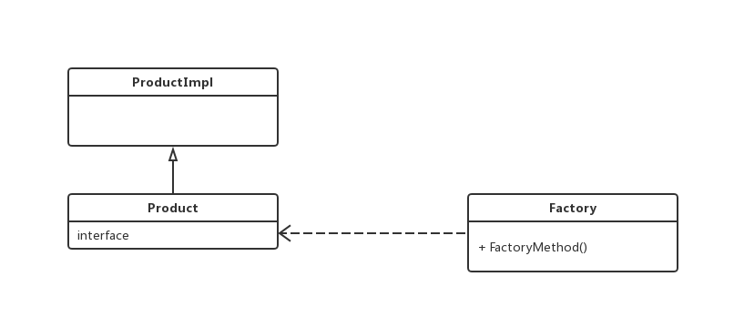

## **简单工厂模式（Abstract Factory Pattern）**
简单工厂模式专门定义一个类来负责创建其他类的实例，被创建的实例通常都具有共同的父类。 

简单工厂模式示意图（[参考](https://blog.csdn.net/itachi85/article/details/50651177)）:

<ul>
<li>Factory：工厂类，简单工厂模式的核心，它负责实现创建所有实例的内部逻辑。工厂类的创建产品类的方法可以被外界直接调用，创建所需的产品对象。
<li>IProduct：抽象产品类，简单工厂模式所创建的所有对象的父类，它负责描述所有实例所共有的公共接口。
<li>Product：具体产品类，是简单工厂模式的创建目标。
</ul>

案例([参考](https://blog.51cto.com/zero01/2067822))： 
完成加减乘除运算：

