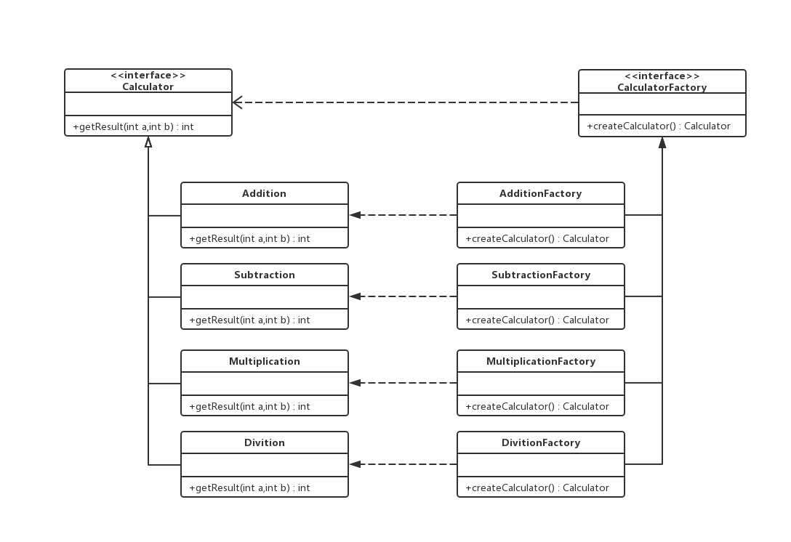

## **工厂方法模式（Factory Method）**
在工厂方法模式中，工厂类是抽象类，实际的创建工作由其具体子类完成。 
工厂方法的用意是定义一个创建产品对象的工厂接口，将实际创建工作推迟到子类中，它强调的是“单个对象”的变化 

如上图，工厂方法模式：共涉及四种角色：
<ol>
<li>抽象工厂角色（Creator）

工厂方法模式的核心，与应用系统无关，任何在创建对象的工厂类必须实现该接口。

</li>
<li>
具体工厂角色（Concrete Creator）

实现抽象工厂接口，含有与应用密切相关的逻辑，通过调节应用程序来创建产品对象。

</li>
<li>
抽象产品角色（Product）

负责定义产品的共性，实现对产品最抽象的定义。

</li>
<li>
具体产品角色（Concrete Product）

实现抽象产品角色所声明的接口，工厂方法模式所创建的每一个对象都是某个具体产品角色的实例。

</li>
</ol>

工厂方法模式的优点
<ol>
<li></li>
</ol>

工厂方法模式案例（计算器）

